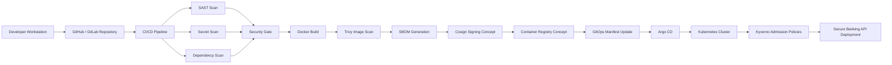
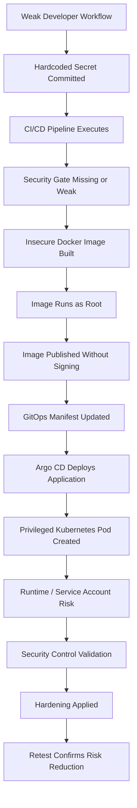
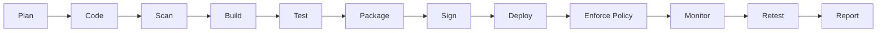
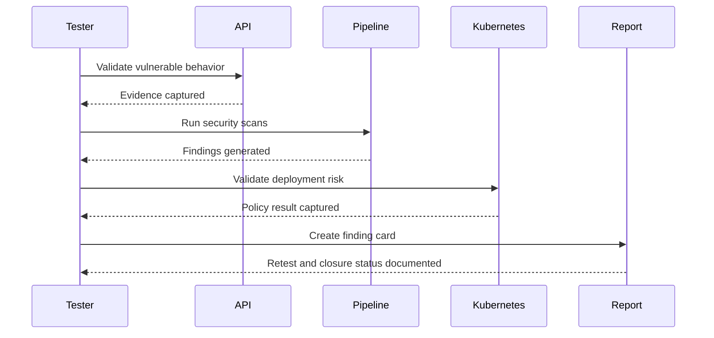
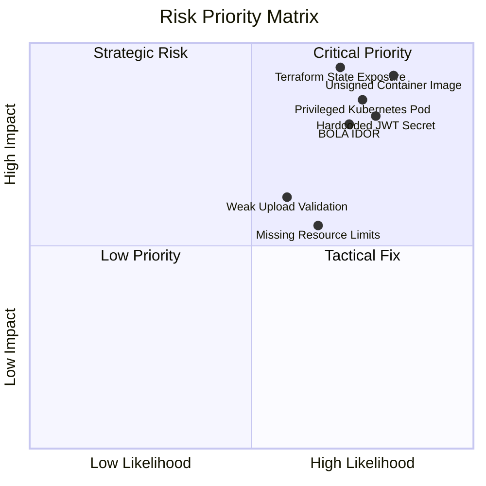

# Enterprise-DevSecOps
<!-- ========================================================= -->
<!-- Enterprise DevSecOps Red Team Lab - Professional README   -->
<!-- Author: Jazz00001 / Rimanshu Sharma                       -->
<!-- ========================================================= -->

<p align="center">
  
</p>

<p align="center">
  <a href="https://github.com/Jazz00001/Enterprise-DevSecOps-Redteam-Lab">
    
  </a>
</p>

<p align="center">
  
  
  
  
</p>


<p align="center">
  
</p>

---

## 🧭 Table of Contents

- [Project Overview](#-project-overview)
- [Executive Summary](#-executive-summary)
- [Business Scenario](#-business-scenario)
- [Assessment Scope](#-assessment-scope)
- [Project Architecture](#-project-architecture)
- [Attack Path](#-attack-path)
- [DevSecOps Lifecycle](#-devsecops-lifecycle)
- [Tools and Technologies](#-tools-and-technologies)
- [Repository Structure](#-repository-structure)
- [Key Security Findings](#-key-security-findings)
- [Sub-Project Breakdown](#-sub-project-breakdown)
- [Evidence Gallery](#-evidence-gallery)
- [Professional Reports](#-professional-reports)
- [Compliance Mapping](#-compliance-mapping)
- [Before vs After Security Maturity](#-before-vs-after-security-maturity)
- [Quick Start](#-quick-start)
- [Interview Talking Points](#-interview-talking-points)
- [Resume Bullet](#-resume-bullet)
- [Ethical Disclaimer](#-ethical-disclaimer)

---

# 🚀 Project Overview

## Enterprise DevSecOps Red Team Lab  
### CI/CD · Kubernetes · GitOps · Supply Chain Security · PTaaS Reporting

This repository is a complete **enterprise-style DevSecOps Red Team and Supply Chain Security Assessment Lab**.

It simulates how a modern cloud-native organization can be compromised through weaknesses in:

- Source code security
- API authorization
- Secret management
- CI/CD pipeline design
- Container image hardening
- Dependency and image scanning
- Software Bill of Materials generation
- Kubernetes workload configuration
- GitOps deployment governance
- Policy-as-Code enforcement
- Terraform/IaC security
- Retest and remediation workflow
- PTaaS-style reporting

The project follows a realistic security consulting lifecycle:

```text
Build → Break → Detect → Harden → Retest → Report
```

This project is built for:

| Target Role | Relevance |
|---|---|
| VAPT / Security Consultant | Finding validation, evidence, remediation, retest |
| Application Security Analyst | API security, SAST, broken access control |
| DevSecOps Security Engineer | CI/CD security gates, policy-as-code, automation |
| Cloud Security Analyst | Kubernetes, IaC, container security |
| Kubernetes Security Engineer | Pod security, resource limits, admission controls |
| Red Team / Purple Team Intern | Attack path simulation and control validation |
| PTaaS Security Analyst | Finding cards, retest reports, compliance mapping |

> This is not a basic scanner-output project. It is structured like a professional security assessment with business impact, technical evidence, remediation, retesting, and compliance mapping.

---

# 🧾 Executive Summary

A fictional financial technology company, **AstraCloud Financial Services**, is migrating a banking API into a cloud-native DevSecOps environment.

The organization uses:

- GitHub / GitLab repositories
- Automated CI/CD pipelines
- Docker containers
- Kubernetes deployments
- GitOps with Argo CD
- Terraform-based infrastructure
- Policy-as-Code controls

The security team wants to validate whether insecure code, exposed secrets, vulnerable dependencies, unsigned images, weak Kubernetes configurations, and GitOps misconfigurations can create a production-like compromise path.

This lab answers that question through a full security assessment.

---

# 🏢 Business Scenario

| Field | Details |
|---|---|
| Company | AstraCloud Financial Services |
| Industry | FinTech / Digital Banking |
| Environment | Cloud-native banking API |
| Assessment Type | DevSecOps Red Team and Supply Chain Security Assessment |
| Application | Vulnerable banking API |
| Deployment Model | CI/CD → Container → Kubernetes → GitOps |
| Security Model | Shift-left + Policy-as-Code + Retest |
| Reporting Style | PTaaS / Security Consulting |

## Business Risk

A single hardcoded secret, weak API authorization check, insecure Dockerfile, or privileged Kubernetes deployment can create a chain of compromise across the software delivery lifecycle.

This project demonstrates how those risks are discovered, validated, hardened, and reported.

---

# 🎯 Assessment Scope

## In Scope

| Area | Coverage |
|---|---|
| API Security | Broken access control, insecure upload, hardcoded secrets |
| CI/CD Security | Security gates, SAST, secret scanning, pipeline abuse |
| Container Security | Root containers, insecure Dockerfiles, Trivy scanning |
| Supply Chain Security | SBOM, image signing concept, SLSA-style mapping |
| Kubernetes Security | Privileged pods, resource limits, insecure manifests |
| GitOps Security | Argo CD application and AppProject restrictions |
| Policy-as-Code | Kyverno admission controls |
| IaC Security | Terraform state exposure and remediation |
| Reporting | Executive summary, finding cards, retest report, compliance map |

## Out of Scope

- Public internet targets
- Third-party systems
- Real banking data
- Real customer information
- Unauthorized exploitation
- Production cloud environments

---

# 🏗️ Project Architecture



---

# ⚔️ Attack Path



---

# 🔄 DevSecOps Lifecycle



| Stage | Security Activity |
|---|---|
| Plan | Threat model and attack path design |
| Code | SAST and secret scanning |
| Build | Secure Dockerfile and dependency checks |
| Test | API security and control validation |
| Package | SBOM generation |
| Sign | Image signing concept |
| Deploy | Kubernetes and GitOps validation |
| Enforce | Kyverno admission policies |
| Retest | Verify remediation effectiveness |
| Report | PTaaS-style deliverables |

---

# 🧰 Tools and Technologies

<p align="center">
  
</p>

| Category | Tools / Concepts |
|---|---|
| API / Application | FastAPI, curl, jq, Postman-style testing |
| CI/CD | GitHub Actions, GitLab CI template |
| SAST | Semgrep |
| Secret Scanning | Gitleaks |
| Dependency / Image Scanning | Trivy |
| Containerization | Docker |
| SBOM | Syft |
| Signing Concept | Cosign |
| Kubernetes | kubectl, Kind / Minikube / K3s |
| GitOps | Argo CD |
| Policy-as-Code | Kyverno |
| IaC | Terraform |
| IaC Security | Checkov / tfsec methodology |
| Runtime Concept | Falco-style runtime detection mapping |
| Reporting | Markdown, CSV, Mermaid, screenshots |
| Compliance Mapping | OWASP, CIS, NIST-style control mapping |


---

# 🚨 Key Security Findings

| ID | Finding | Severity | Category | Status |
|---|---|---:|---|---|
| DEVSEC-001 | Hardcoded JWT secret in source code | High | Secret Management | Remediated / Documented |
| DEVSEC-002 | Broken object-level authorization in profile endpoint | High | API Security | Documented |
| DEVSEC-003 | Weak file upload validation | Medium | API Security | Documented |
| DEVSEC-004 | Dockerfile runs container as root | High | Container Security | Fixed |
| DEVSEC-005 | Container image lacks healthcheck and hardening | Medium | Container Security | Fixed |
| DEVSEC-006 | Kubernetes deployment allows privileged container | High | Kubernetes Security | Blocked by Policy |
| DEVSEC-007 | Kubernetes deployment missing CPU/memory limits | Medium | Kubernetes Security | Fixed |
| DEVSEC-008 | Unsigned container image allowed | Critical | Supply Chain Security | Control Documented |
| DEVSEC-009 | Broad GitOps namespace permissions | High | GitOps Security | Restricted |
| DEVSEC-010 | Terraform state exposure risk | Critical | IaC Security | Mitigation Documented |

---

# 🧪 Sub-Project Breakdown

## 1️⃣ API Security Assessment

### Objective

Validate whether the banking API contains common application security weaknesses that could expose user data or allow unauthorized access.

### Tested Areas

- Hardcoded secrets
- Broken object-level authorization
- Weak file upload validation
- Missing authorization controls
- API endpoint abuse
- Security remediation mapping

### Evidence

| Evidence | File |
|---|---|
| API running locally | `evidence/screenshots/05-api-running.png` |
| API health check | `evidence/screenshots/06-api-health-check.png` |
| BOLA / IDOR test | `evidence/screenshots/07-bola-idor-test.png` |
| JWT secret finding | `evidence/screenshots/08-jwt-secret-finding.png` |
| File upload validation | `evidence/screenshots/09-file-upload-validation.png` |

---

## 2️⃣ CI/CD Pipeline Security

### Objective

Assess whether the CI/CD workflow can detect and block insecure code before deployment.

### Tested Areas

- Semgrep SAST
- Gitleaks secret scanning
- Trivy dependency / image scanning
- Failing security gate
- Retest after remediation
- GitHub Actions evidence
- GitLab CI hardened workflow

### Evidence

| Evidence | File |
|---|---|
| GitHub Actions workflow | `evidence/screenshots/10-github-actions-workflow.png` |
| Failed security gate | `evidence/screenshots/11-failed-security-gate.png` |
| Semgrep result | `evidence/screenshots/12-semgrep-result.png` |
| Gitleaks result | `evidence/screenshots/13-gitleaks-result.png` |
| Retest pipeline success | `evidence/screenshots/14-retest-pipeline-success.png` |

---

## 3️⃣ Container and Supply Chain Security

### Objective

Demonstrate insecure vs secure container builds and supply-chain security controls.

### Tested Areas

- Insecure Dockerfile
- Root container risk
- Secure Dockerfile hardening
- Trivy container image scan
- SBOM generation
- Image signing concept
- SLSA-style supply-chain mapping

### Evidence

| Evidence | File |
|---|---|
| Insecure Docker build | `evidence/screenshots/15-insecure-docker-build.png` |
| Secure Docker build | `evidence/screenshots/16-secure-docker-build.png` |
| Trivy scan | `evidence/screenshots/17-trivy-scan-result.png` |
| SBOM generation | `evidence/screenshots/18-sbom-generation.png` |
| Before/after hardening | `evidence/screenshots/19-container-before-after.png` |

---

## 4️⃣ Kubernetes and GitOps Security

### Objective

Validate Kubernetes workload security and GitOps deployment restrictions.

### Tested Areas

- Privileged container deployment
- Missing CPU/memory limits
- Insecure Kubernetes manifest
- Secure Kubernetes manifest
- Argo CD AppProject restriction
- Kyverno admission control
- Secure deployment retest

### Evidence

| Evidence | File |
|---|---|
| Cluster running | `evidence/screenshots/20-kind-cluster-running.png` |
| Insecure K8s deployment | `evidence/screenshots/21-insecure-k8s-deployment.png` |
| Kyverno policy block | `evidence/screenshots/22-kyverno-policy-block.png` |
| Secure deployment accepted | `evidence/screenshots/23-secure-k8s-deployment.png` |
| Argo CD application | `evidence/screenshots/24-argocd-application.png` |

---

## 5️⃣ IaC, Policy-as-Code and Compliance

### Objective

Document infrastructure-as-code risk and map technical controls to compliance expectations.

### Tested Areas

- Terraform state exposure risk
- IaC remediation
- Policy-as-Code control matrix
- Compliance mapping
- Risk register
- Retest documentation

### Evidence

| Evidence | File |
|---|---|
| Terraform review | `evidence/screenshots/25-terraform-review.png` |
| IaC risk evidence | `evidence/screenshots/26-iac-risk-evidence.png` |
| Compliance mapping | `evidence/screenshots/27-compliance-mapping.png` |
| Risk register | `evidence/screenshots/28-risk-register.png` |
| Control validation matrix | `evidence/screenshots/29-control-validation-matrix.png` |

---

## 6️⃣ PTaaS-Style Professional Reporting

### Objective

Present findings like a professional penetration testing / PTaaS engagement.

### Deliverables

- Executive summary
- Technical report
- API security assessment
- Risk register
- Remediation roadmap
- Retest report
- Compliance mapping
- PTaaS finding cards
- Astra-style platform alignment
- Resume bullets
- LinkedIn post

### Evidence

| Evidence | File |
|---|---|
| Executive report | `evidence/screenshots/30-executive-report.png` |
| Technical report | `evidence/screenshots/31-technical-report.png` |
| Finding cards | `evidence/screenshots/32-finding-cards.png` |
| Retest report | `evidence/screenshots/33-retest-report.png` |
| Jira/Slack workflow concept | `evidence/screenshots/34-jira-slack-workflow.png` |
| Screenshot index | `evidence/screenshots/35-screenshot-index.png` |

---

# 🖼️ Evidence Gallery

> Screenshots should be redacted before public upload. Do not expose JWTs, API keys, tokens, cookies, cloud IDs, internal IPs, private emails, or real credentials.

## Tooling Setup

| Basic Tools | Docker | kubectl | Kind |
|---|---|---|---|
|  |  |  |  |

## API and CI/CD Evidence

| API Running | Health Check | GitHub Actions | Failed Gate |
|---|---|---|---|
|  |  |  |  |

## Container and Kubernetes Evidence

| Trivy Scan | SBOM | Kyverno Block | Secure Deploy |
|---|---|---|---|
|  |  |  |  |

## Reporting Evidence

| Finding Cards | Retest Report | Compliance Mapping | Workflow Concept |
|---|---|---|---|
|  |  |  |  |

---

# 📄 Professional Reports

| Report | Location | Purpose |
|---|---|---|
| Executive Summary | [`reports/executive-summary.md`](reports/executive-summary.md) | Business-level risk explanation |
| Technical Report | [`reports/technical-report.md`](reports/technical-report.md) | Detailed technical findings |
| API Security Assessment | [`reports/api-security-assessment.md`](reports/api-security-assessment.md) | API-specific security review |
| DevSecOps Maturity Assessment | [`reports/devsecops-maturity-assessment.md`](reports/devsecops-maturity-assessment.md) | Before/after security maturity |
| Risk Register | [`reports/risk-register.csv`](reports/risk-register.csv) | Risk tracking and severity |
| Retest Report | [`reports/retest-report.md`](reports/retest-report.md) | Remediation validation |
| Remediation Roadmap | [`reports/remediation-roadmap.md`](reports/remediation-roadmap.md) | Step-by-step fix plan |
| Security Control Matrix | [`reports/security-control-validation-matrix.md`](reports/security-control-validation-matrix.md) | Control validation |
| Compliance Mapping | [`reports/compliance-mapping.md`](reports/compliance-mapping.md) | Security-to-compliance alignment |
| Astra PTaaS Alignment | [`reports/astra-ptaas-alignment.md`](reports/astra-ptaas-alignment.md) | PTaaS-style project positioning |
| Resume Bullets | [`reports/resume-bullets.md`](reports/resume-bullets.md) | Resume-ready impact statements |
| LinkedIn Post | [`reports/linkedin-post.md`](reports/linkedin-post.md) | Public project announcement |

---

# 🧩 Finding Card Format

Each finding is documented in a PTaaS-style format:

```text
Finding ID
Title
Severity
Affected Asset
Business Impact
Technical Evidence
Steps to Reproduce
Root Cause
Remediation
Retest Status
References / Control Mapping
```

## Example Finding Flow



---

# 🛡️ Compliance Mapping

This lab maps technical findings to common security frameworks and control areas.

| Control Area | Example Mapping |
|---|---|
| API Security | OWASP API Security Top 10 |
| Web/Application Security | OWASP ASVS concepts |
| Container Security | CIS Docker / container hardening concepts |
| Kubernetes Security | CIS Kubernetes Benchmark concepts |
| Secret Management | Secure SDLC / credential management controls |
| CI/CD Security | Supply-chain and pipeline integrity controls |
| IaC Security | Secure configuration and state protection |
| Risk Management | NIST-style identify/protect/detect/respond mapping |
| Retest | Vulnerability management lifecycle |

---

# 📊 Before vs After Security Maturity

| Control Area | Before | After | Improvement |
|---|---:|---:|---|
| Source Code Security | 1/5 | 4/5 | ✅ SAST and secure coding controls |
| CI/CD Security | 1/5 | 4/5 | ✅ Security gates added |
| Secret Management | 1/5 | 4/5 | ✅ Gitleaks and remediation |
| Container Security | 1/5 | 5/5 | ✅ Secure Dockerfile and Trivy scanning |
| Supply Chain Integrity | 0/5 | 4/5 | ✅ SBOM and signing concept |
| Kubernetes Security | 1/5 | 5/5 | ✅ Secure manifests and Kyverno |
| GitOps Security | 1/5 | 4/5 | ✅ Restricted AppProject |
| Policy-as-Code | 0/5 | 5/5 | ✅ Admission control enforcement |
| IaC Security | 1/5 | 4/5 | ✅ Terraform risk documented |
| Reporting and Retest | 1/5 | 5/5 | ✅ PTaaS-style reporting |

---

# 🧪 Risk Heatmap



---

# ⚙️ Quick Start

## Prerequisites

Install the following:

```bash
docker --version
kubectl version --client
kind version
python3 --version
git --version
```

Recommended tools:

```bash
semgrep --version
gitleaks version
trivy --version
syft version
```

---

## 1. Clone the Repository

```bash
git clone https://github.com/Jazz00001/Enterprise-DevSecOps-Redteam-Lab.git
cd Enterprise-DevSecOps-Redteam-Lab
```

---

## 2. Run the Banking API Locally

```bash
cd app
python3 -m venv venv
source venv/bin/activate
pip install -r requirements.txt
uvicorn main:app --host 0.0.0.0 --port 8000
```

Test the API:

```bash
curl http://localhost:8000/health
curl http://localhost:8000/profile/1001
```

---

## 3. Build Insecure and Secure Containers

```bash
docker build -f docker/Dockerfile.insecure -t astracloud-api:insecure .
docker build -f docker/Dockerfile.secure -t astracloud-api:secure .
```

---

## 4. Run Security Scans

```bash
bash scripts/02-security-scans.sh
```

Expected scan categories:

```text
Semgrep  → Static Application Security Testing
Gitleaks → Secret Detection
Trivy    → Dependency and Container Image Scanning
Syft     → SBOM Generation
```

---

## 5. Create Kubernetes Cluster

```bash
bash scripts/03-kind-cluster.sh
```

Validate:

```bash
kubectl get nodes
kubectl get pods -A
```

---

## 6. Deploy Insecure Workload

```bash
bash scripts/04-deploy-insecure.sh
```

---

## 7. Install and Apply Kyverno Policies

```bash
bash scripts/05-install-kyverno.sh
bash scripts/06-apply-policies.sh
```

---

## 8. Deploy Secure Workload

```bash
bash scripts/07-deploy-secure.sh
```

---

# 🔐 Security Control Validation

| Control | Validation Method | Evidence |
|---|---|---|
| Secret scanning | Gitleaks scan | `security-scans/gitleaks-results.md` |
| SAST | Semgrep rules | `security-scans/semgrep-results.md` |
| Container image scan | Trivy scan | `security-scans/trivy-results.md` |
| SBOM | Syft output | `security-scans/sbom-summary.md` |
| Privileged pod prevention | Kyverno block | `policy-as-code/kyverno/` |
| Resource limit enforcement | Kubernetes manifest + Kyverno | `kubernetes/` |
| GitOps restriction | Argo CD AppProject | `argocd/` |
| IaC risk documentation | Terraform state review | `terraform/` |
| Retest validation | Before/after comparison | `reports/retest-report.md` |

---

# 🧠 What I Learned

This lab demonstrates practical knowledge of:

- How secrets enter the software supply chain
- Why CI/CD security gates matter
- How insecure Dockerfiles increase runtime risk
- Why SBOMs matter for enterprise visibility
- How unsigned images can weaken deployment trust
- How Kubernetes workloads become risky through misconfiguration
- How GitOps can deploy insecure changes if not restricted
- How Kyverno policies enforce secure defaults
- Why retesting is critical after remediation
- How to write professional security reports, not just run tools

---


## What Makes This Project Different

- It is not only a tool demo.
- It follows a full security assessment lifecycle.
- It includes before/after hardening.
- It connects technical risk to business impact.
- It includes retest evidence.
- It includes professional reporting.
- It is aligned with real DevSecOps and PTaaS workflows.

---

# 🧑‍💼 Resume Bullet

```text
Built an enterprise DevSecOps Red Team lab simulating CI/CD abuse, API security flaws, container image risk, Kubernetes misconfiguration, GitOps deployment weakness, Terraform/IaC exposure, and software supply-chain threats; implemented security gates using Semgrep, Gitleaks, Trivy, Syft, Docker, Kubernetes, Argo CD, and Kyverno, then produced PTaaS-style finding cards, compliance mapping, risk register, remediation roadmap, and retest report.
```

---

# 🔗 Suggested LinkedIn Post

```text
I completed an Enterprise DevSecOps Red Team Lab focused on CI/CD, Kubernetes, GitOps, API security, container security, and software supply-chain risk.

The project simulates a cloud-native banking API moving through a modern DevSecOps pipeline and demonstrates how risks such as hardcoded secrets, broken authorization, insecure Dockerfiles, privileged Kubernetes pods, unsigned images, broad GitOps permissions, and Terraform state exposure can impact an organization.

Tools and concepts used:
- FastAPI
- GitHub Actions
- GitLab CI
- Semgrep
- Gitleaks
- Trivy
- Docker
- Syft SBOM
- Kubernetes
- Argo CD
- Kyverno
- Terraform
- PTaaS-style reporting

The project includes:
- Executive report
- Technical report
- Finding cards
- Risk register
- Compliance mapping
- Remediation roadmap
- Retest report
- Evidence screenshots

This helped me understand how modern application security, DevSecOps, and cloud-native security fit together in a real assessment workflow.
```

---

# ✅ Final Project Checklist

| Task | Status |
|---|---:|
| Vulnerable banking API created | ✅ |
| API security findings documented | ✅ |
| CI/CD security pipeline added | ✅ |
| SAST scan documented | ✅ |
| Secret scanning documented | ✅ |
| Trivy image scan documented | ✅ |
| Insecure Dockerfile created | ✅ |
| Secure Dockerfile created | ✅ |
| SBOM concept documented | ✅ |
| Kubernetes manifests created | ✅ |
| Argo CD GitOps risk documented | ✅ |
| Kyverno policies added | ✅ |
| Terraform/IaC risk documented | ✅ |
| Risk register created | ✅ |
| Compliance mapping created | ✅ |
| Retest report created | ✅ |
| PTaaS finding cards created | ✅ |
| Screenshot evidence added | ⬜ Add / update |
| LinkedIn and resume content prepared | ✅ |

---

# 🚫 Ethical Disclaimer

This repository is a controlled educational cybersecurity lab.

All testing was performed only against self-owned, local, intentionally vulnerable, or simulated lab environments.

Do not use any technique, script, payload, scan, or methodology from this repository against systems you do not own or do not have explicit written authorization to test.

This project is intended for:

- Cybersecurity learning
- DevSecOps practice
- Portfolio development
- Security assessment methodology
- Responsible security research

---

<p align="center">
  
</p>

<p align="center">
  <b>Build Secure. Break Safely. Harden Continuously. Report Professionally.</b>
</p>
