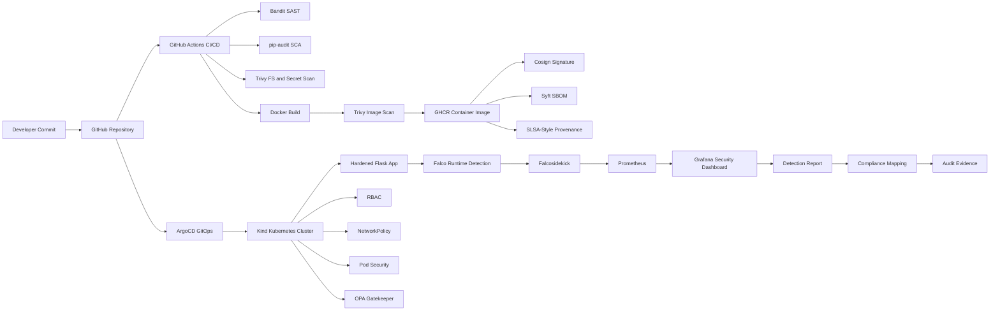
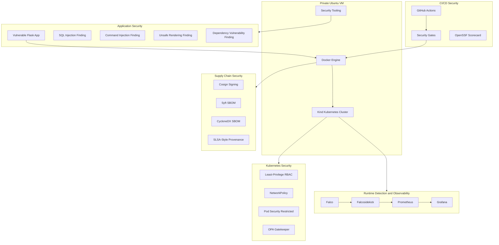
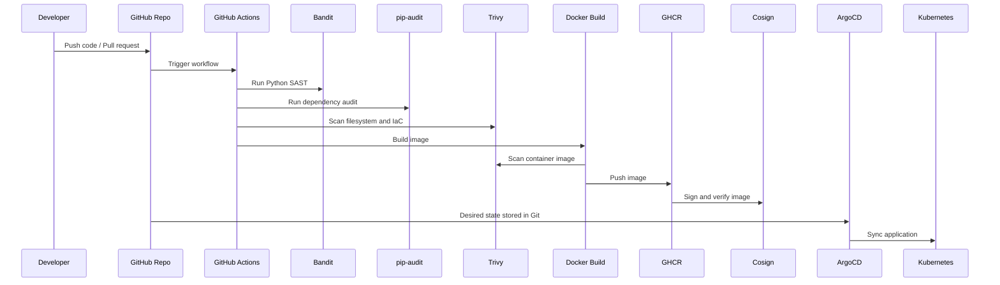
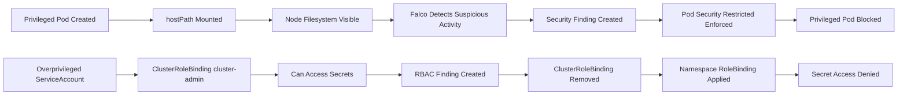
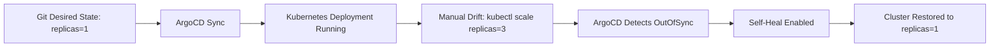
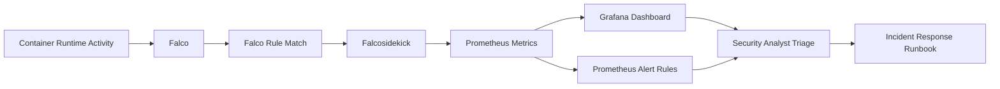
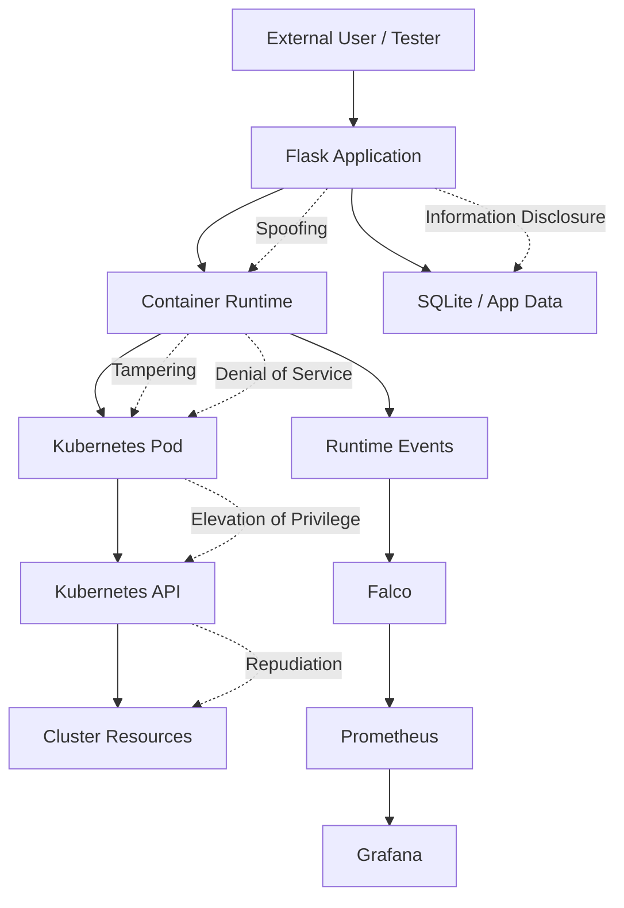

<p align="center">
  
</p>

<p align="center">
  
</p>

<p align="center">
  <a href="./SECURITY.md"></a>
  <a href="./docker-compose.yml"></a>
  <a href="./k8s/base"></a>
  <a href="./security/sbom"></a>
  <a href="./monitoring"></a>
</p>

<p align="center">
  
  
  
  
  
  
  
</p>

---

# Enterprise DevSecOps Security Lab

## Executive Summary

This project is a **private, end-to-end Enterprise DevSecOps Security Lab** designed to demonstrate how modern security engineering is applied across the full software delivery lifecycle.

The lab starts with a deliberately vulnerable Flask application and progressively secures it through:

* Application security testing
* CI/CD security gates
* Docker image hardening
* Kubernetes security controls
* GitOps deployment with drift correction
* Software supply chain security
* SBOM generation and signing evidence
* Runtime threat detection
* Security observability
* Compliance-style control mapping
* Professional reporting and retest proof

The project was built to simulate how security teams, DevSecOps engineers, cloud security engineers, and application security engineers secure real workloads before they reach production.

> **Important:** This repository contains intentionally vulnerable code and attack simulations for controlled private-lab learning only. It must not be exposed to the public internet or used against third-party systems.

---

## Project Story

This lab follows a realistic enterprise security journey:

```text
Vulnerable Flask Application
        ↓
Application Security Testing
        ↓
Secure Code Remediation
        ↓
Docker Hardening
        ↓
CI/CD Security Gates
        ↓
Container Image Scanning
        ↓
Kubernetes Hardening
        ↓
GitOps Deployment
        ↓
Supply Chain Security
        ↓
Runtime Detection
        ↓
Security Observability
        ↓
Compliance Mapping and Audit Evidence
```

The project does not only show tools. It shows a complete security workflow:

1. **Find** the issue.
2. **Exploit safely** inside a private lab.
3. **Document evidence**.
4. **Map risk and impact**.
5. **Remediate or accept risk**.
6. **Retest and prove closure**.
7. **Convert evidence into professional reports**.

---

## Animated Architecture



---

## High-Level Security Architecture



---

## What This Project Demonstrates

| Domain                | Implemented Capability                                                                                   |
| --------------------- | -------------------------------------------------------------------------------------------------------- |
| Application Security  | SQL injection, command injection, unsafe rendering, dependency vulnerability analysis                    |
| Secure Code           | Remediation examples, security tests, safer coding patterns                                              |
| CI/CD Security        | Security gates, scanner integration, workflow hardening, OpenSSF Scorecard                               |
| Container Security    | Hardened Dockerfile, non-root user, Trivy image scanning                                                 |
| Kubernetes Security   | RBAC, NetworkPolicy, Pod Security, secure deployment manifests                                           |
| GitOps                | ArgoCD application sync, drift detection, self-healing                                                   |
| Supply Chain Security | Cosign signing, Syft SBOM, CycloneDX, SPDX, provenance evidence                                          |
| Runtime Security      | Falco detections, Falcosidekick forwarding, Prometheus alerts                                            |
| Observability         | Grafana dashboard, Prometheus queries, alert rules                                                       |
| Compliance            | NIST SSDF, OWASP ASVS, CIS Kubernetes Benchmark, SLSA, SOC 2 style, ISO 27001 style, PCI/HIPAA alignment |
| Reporting             | Findings reports, retest proof, evidence index, post-mortem, risk register                               |

---

## Technology Stack

| Layer                             | Tools                                                |
| --------------------------------- | ---------------------------------------------------- |
| Application                       | Python, Flask                                        |
| Testing                           | pytest                                               |
| SAST                              | Bandit                                               |
| SCA                               | pip-audit                                            |
| Filesystem / Image / IaC Scanning | Trivy                                                |
| Containerization                  | Docker, Docker Compose                               |
| Kubernetes                        | Kind, kubectl, Helm                                  |
| GitOps                            | ArgoCD                                               |
| Policy-as-Code                    | OPA Gatekeeper                                       |
| Runtime Detection                 | Falco                                                |
| Event Forwarding                  | Falcosidekick                                        |
| Metrics                           | Prometheus                                           |
| Dashboarding                      | Grafana                                              |
| Supply Chain                      | Cosign, Syft, SPDX, CycloneDX, SLSA-style provenance |
| Repository Security               | OpenSSF Scorecard, GitHub Actions                    |
| Documentation                     | Markdown, PDF reports, diagrams, evidence index      |

---

## Repository Structure

```text
Enterprise-DevSecOps/
├── .github/
│   ├── workflows/
│   │   ├── security-gates.yml
│   │   └── scorecard.yml
│   └── ISSUE_TEMPLATE/
│       └── security_exception_request.md
│
├── src/
│   └── app/
│       ├── app.py
│       ├── init_db.py
│       └── requirements.txt
│
├── tests/
│   ├── test_health.py
│   ├── test_routes.py
│   └── test_security_headers.py
│
├── k8s/
│   └── base/
│       ├── namespace.yaml
│       ├── rbac.yaml
│       ├── deployment.yaml
│       ├── service.yaml
│       ├── network-policy.yaml
│       └── kustomization.yaml
│
├── monitoring/
│   ├── dashboards/
│   │   └── falco_security_dashboard.json
│   ├── rules/
│   │   └── falco_security_prometheus_rules.yaml
│   └── values/
│
├── security/
│   ├── reports/
│   ├── sbom/
│   ├── cosign/
│   ├── provenance/
│   └── policies/
│
├── redteam/
│   ├── runtime/
│   └── rbac/
│
├── docs/
│   ├── architecture/
│   ├── evidence/
│   ├── findings/
│   ├── templates/
│   └── reports/
│
├── diagrams/
│   └── data-flow-diagram.svg
│
├── evidence/
│   └── screenshots/
│
├── Dockerfile
├── docker-compose.yml
├── kind-cluster.yaml
├── SECURITY.md
├── SECURITY_EXCEPTION_TEMPLATE.md
├── SECURITY_FINDINGS_REPORT.md
├── README.md
└── LICENSE
```

---

## Vulnerable Application Scope

The project includes a deliberately vulnerable Flask application to demonstrate realistic AppSec testing.

| Route          | Vulnerability Type                         | Purpose                                               |
| -------------- | ------------------------------------------ | ----------------------------------------------------- |
| `/health`      | Health check                               | Used for tests, Docker healthcheck, Kubernetes probes |
| `/user?id=`    | SQL Injection                              | Demonstrates unsafe query construction                |
| `/ping?host=`  | Command Injection                          | Demonstrates unsafe shell execution                   |
| `/hello?name=` | Unsafe rendering / template injection risk | Demonstrates unsafe user-controlled rendering         |

---

## Application Security Findings

| ID      | Finding                   |      Severity | CWE / OWASP Mapping      | Status              |
| ------- | ------------------------- | ------------: | ------------------------ | ------------------- |
| APP-001 | SQL Injection             |          High | CWE-89 / OWASP Injection | Documented          |
| APP-002 | Command Injection         |          High | CWE-78 / OWASP Injection | Documented          |
| APP-003 | Unsafe Template Rendering |          High | CWE-94 / CWE-1336        | Documented          |
| APP-004 | Vulnerable Dependency     | Medium / High | CWE-937 / CWE-1104       | Documented          |
| APP-005 | Missing Security Headers  |        Medium | OWASP Secure Headers     | Test coverage added |

---

## Secure Remediation Examples

| Insecure Pattern                   | Secure Remediation                            |
| ---------------------------------- | --------------------------------------------- |
| SQL query string interpolation     | Parameterized SQL queries                     |
| `shell=True` with user input       | Subprocess argument list with validation      |
| User-controlled template rendering | Static templates with safe context variables  |
| Unpinned vulnerable dependencies   | Version pinning and dependency upgrades       |
| Missing security headers           | Flask `after_request` security headers        |
| Root container execution           | Non-root UID/GID                              |
| Writable root filesystem           | Read-only root filesystem and writable `/tmp` |
| Overprivileged RBAC                | Namespace-scoped least privilege              |
| Missing NetworkPolicy              | Default deny and explicit allow               |
| Unsigned image                     | Cosign signature and verification             |

---

## CI/CD Security Gates

This project includes GitHub Actions workflows for security automation.

### Implemented Workflows

| Workflow             | Purpose                                                           |
| -------------------- | ----------------------------------------------------------------- |
| `security-gates.yml` | Blocks critical security issues in CI/CD                          |
| `scorecard.yml`      | Evaluates repository supply chain posture using OpenSSF Scorecard |

### Security Gate Conditions

| Gate                | Fail Condition                                                              |
| ------------------- | --------------------------------------------------------------------------- |
| Dependency Security | Critical dependency vulnerability = fail                                    |
| Container Security  | Critical container vulnerability = fail                                     |
| Secret Scanning     | Secret found = fail                                                         |
| Dockerfile Security | Critical Dockerfile misconfiguration = fail                                 |
| Kubernetes Security | Critical Kubernetes manifest misconfiguration = fail                        |
| SAST                | High/Critical unsafe code pattern after remediation baseline = fail         |
| Supply Chain        | Missing expected signature, SBOM, or provenance in protected release = fail |

---

## CI/CD Pipeline Flow



---

## Docker Security

The Docker implementation is designed to demonstrate production-style hardening.

### Docker Controls

| Control               | Implemented |
| --------------------- | ----------- |
| Multi-stage build     | Yes         |
| Non-root runtime user | Yes         |
| Fixed UID/GID         | Yes         |
| Minimal runtime image | Yes         |
| No pip cache          | Yes         |
| Gunicorn runtime      | Yes         |
| Healthcheck           | Yes         |
| Trivy image scan      | Yes         |
| Syft SBOM             | Yes         |
| Cosign signing        | Yes         |

### Docker Commands

```bash
docker build -t devsecops-vuln-app:lab .

docker run --rm -p 8080:5000 devsecops-vuln-app:lab

docker run --rm --entrypoint id devsecops-vuln-app:lab
```

---

## Docker Compose Usage

This project includes a professional `docker-compose.yml` to support local app execution, scanning, SBOM generation, and optional observability.

```bash
docker compose up --build demo-app
```

```bash
docker compose --profile security run --rm bandit-sast
docker compose --profile security run --rm pip-audit-sca
docker compose --profile security run --rm trivy-fs-scan
docker compose --profile security run --rm trivy-image-scan
```

```bash
docker compose --profile sbom run --rm syft-sbom
```

```bash
docker compose --profile monitoring up -d prometheus grafana node-exporter cadvisor falcosidekick
```

---

## Kubernetes Security

The Kubernetes phase demonstrates how a vulnerable application can be deployed into a hardened cluster environment.

### Kubernetes Controls

| Control                        | Implementation                        |
| ------------------------------ | ------------------------------------- |
| Dedicated namespace            | `devsecops`                           |
| Restricted Pod Security labels | Namespace-level enforcement           |
| Dedicated ServiceAccount       | `demo-app-sa`                         |
| Token auto-mount disabled      | `automountServiceAccountToken: false` |
| Non-root execution             | `runAsNonRoot: true`                  |
| Privilege escalation blocked   | `allowPrivilegeEscalation: false`     |
| Linux capabilities dropped     | `drop: ["ALL"]`                       |
| Read-only root filesystem      | `readOnlyRootFilesystem: true`        |
| Seccomp profile                | `RuntimeDefault`                      |
| Resource requests/limits       | CPU and memory configured             |
| Health probes                  | Liveness and readiness probes         |
| NetworkPolicy                  | Default deny and explicit allow       |
| RBAC                           | Least privilege                       |
| Admission control              | OPA Gatekeeper                        |

---

## Kubernetes Attack and Remediation Flow



---

## RBAC Review

The project demonstrates both insecure and secure RBAC patterns.

| Scenario                                | Result                          |
| --------------------------------------- | ------------------------------- |
| ServiceAccount bound to `cluster-admin` | Can access cluster-wide secrets |
| Dangerous ClusterRoleBinding removed    | Privilege reduced               |
| Namespace RoleBinding applied           | Limited ConfigMap read access   |
| Secret access retested                  | Denied                          |
| Cluster-wide access retested            | Denied                          |

Validation command example:

```bash
kubectl auth can-i get secrets \
  --as=system:serviceaccount:devsecops:demo-app-sa \
  -n devsecops
```

Expected secure result:

```text
no
```

---

## NetworkPolicy Validation

The project uses NetworkPolicy to demonstrate zero-trust network segmentation.

| Policy Control       | Purpose                           |
| -------------------- | --------------------------------- |
| Default deny ingress | Blocks unexpected inbound traffic |
| Default deny egress  | Restricts outbound communication  |
| Explicit app ingress | Allows only trusted traffic       |
| DNS egress allowed   | Supports name resolution          |
| Validation pods      | Prove allow/deny behavior         |

---

## Pod Security Validation

Pod Security validation demonstrates that unsafe Kubernetes workload patterns are blocked.

| Risky Pattern            | Expected Secure Result                |
| ------------------------ | ------------------------------------- |
| `privileged: true`       | Blocked                               |
| hostPath `/` mount       | Blocked                               |
| privilege escalation     | Blocked                               |
| root container           | Blocked                               |
| missing seccomp          | Warned or blocked depending on policy |
| writable root filesystem | Hardened in secure deployment         |

---

## GitOps with ArgoCD

ArgoCD is used to demonstrate enterprise GitOps principles.

| GitOps Capability      | Implemented |
| ---------------------- | ----------- |
| Git as source of truth | Yes         |
| Automated sync         | Yes         |
| Self-healing           | Yes         |
| Pruning                | Yes         |
| Drift detection        | Yes         |
| Drift remediation      | Yes         |

### GitOps Drift Demo



---

## Supply Chain Security

The supply chain phase makes the project enterprise-grade by adding artifact integrity and transparency.

### Implemented Supply Chain Controls

| Control                  | Tool                       | Evidence                    |
| ------------------------ | -------------------------- | --------------------------- |
| Image signing            | Cosign                     | Signature verification      |
| SBOM generation          | Syft                       | SPDX and CycloneDX SBOM     |
| Package inventory        | Syft                       | SBOM package count          |
| Vulnerability visibility | Trivy                      | Top vulnerable packages     |
| Provenance               | SLSA-style local predicate | Build traceability          |
| Repository posture       | OpenSSF Scorecard          | Supply chain score          |
| Vulnerability exceptions | Exception template         | Accepted risk documentation |
| VEX notes                | VEX-style notes            | Exploitability context      |

### Enterprise Evidence Fields

| Evidence Item                 | Included |
| ----------------------------- | -------- |
| Image digest                  | Yes      |
| Signature verification result | Yes      |
| SBOM package count            | Yes      |
| Top vulnerable packages       | Yes      |
| Why vulnerable packages exist | Yes      |
| What was fixed                | Yes      |
| What remains accepted risk    | Yes      |
| SLSA relevance                | Yes      |
| CycloneDX value               | Yes      |

---

## Runtime Detection Engineering

The runtime detection phase uses Falco, Falcosidekick, Prometheus, and Grafana.



### Detection Report Fields

Each detection includes:

| Field                | Included |
| -------------------- | -------- |
| Detection name       | Yes      |
| MITRE ATT&CK mapping | Yes      |
| Log source           | Yes      |
| Trigger condition    | Yes      |
| False positives      | Yes      |
| Severity             | Yes      |
| Triage steps         | Yes      |
| Response steps       | Yes      |
| Evidence screenshot  | Yes      |

---

## Falco Detection Examples

| Detection                             | MITRE Mapping                            |      Severity | Log Source                  |
| ------------------------------------- | ---------------------------------------- | ------------: | --------------------------- |
| Sensitive file access from container  | Credential Access                        |          High | Falco runtime event         |
| Privileged pod host filesystem access | Escape to Host / Privilege Escalation    |      Critical | Falco + Kubernetes          |
| Shell spawned in container            | Execution                                | Medium / High | Falco                       |
| Event drops detected                  | Defense Evasion / Detection Quality Risk |          High | Falco metrics               |
| RBAC escalation simulation            | Privilege Escalation                     |          High | Kubernetes API + validation |

---

## Prometheus and Grafana Security Observability

The project includes dashboards and rules for security monitoring.

### Dashboard Panels

| Panel                            | Purpose                           |
| -------------------------------- | --------------------------------- |
| Falco detections last 10 minutes | Quick runtime security visibility |
| Events by priority               | Severity distribution             |
| Top triggered rules              | Detection hotspot analysis        |
| Kernel event processing rate     | Falco health monitoring           |
| Dropped events                   | Detection quality assurance       |

### Prometheus Rules

| Alert                   | Purpose                        |
| ----------------------- | ------------------------------ |
| `FalcoRuntimeDetection` | Alert when Falco rules trigger |
| `FalcoKernelEventDrops` | Alert on kernel event drops    |
| `FalcoOutputQueueDrops` | Alert on Falco output drops    |

---

## Compliance and Control Mapping

This project includes compliance-style mapping for security evidence.

| Framework                      | Mapping Purpose                                              |
| ------------------------------ | ------------------------------------------------------------ |
| NIST SSDF                      | Secure software development practices                        |
| OWASP ASVS                     | Application security controls                                |
| CIS Kubernetes Benchmark       | Kubernetes secure configuration guidance                     |
| SLSA                           | Supply chain integrity and tamper resistance                 |
| SOC 2 style controls           | Security, availability, confidentiality alignment            |
| ISO 27001 style controls       | Security governance and risk management alignment            |
| PCI/HIPAA style alignment only | Demonstrates conceptual control alignment, not certification |

> This project does not claim formal certification. The compliance documents are alignment artifacts for portfolio and learning purposes.

---

## Threat Modeling

The project includes STRIDE-based threat modeling.

### STRIDE Categories

| STRIDE Category        | Example Project Risk                                 |
| ---------------------- | ---------------------------------------------------- |
| Spoofing               | ServiceAccount misuse or weak identity boundaries    |
| Tampering              | Image or manifest modification                       |
| Repudiation            | Missing audit evidence or weak pipeline traceability |
| Information Disclosure | Secret access, SQL injection, SBOM exposure          |
| Denial of Service      | Resource exhaustion, missing limits                  |
| Elevation of Privilege | Cluster-admin RBAC, privileged pods                  |

### STRIDE Flow



---

## Professional Documentation Package

This project includes a complete documentation set.

| Document                                        | Purpose                               |
| ----------------------------------------------- | ------------------------------------- |
| `PROJECT_SUMMARY`                               | Executive project overview            |
| `Methodology`                                   | How the project was performed         |
| `SECURITY_FINDINGS_REPORT`                      | Professional vulnerability report     |
| `SQL Injection Finding`                         | Dedicated finding document            |
| `Command Injection Finding`                     | Dedicated finding document            |
| `Template Injection / Unsafe Rendering Finding` | Dedicated finding document            |
| `Dependency Vulnerability Finding`              | Dedicated finding document            |
| `Secure Code Remediation Examples`              | Secure coding fixes and patterns      |
| `Retest Proof`                                  | Validation after remediation          |
| `DevSecOps Pipeline Deep Dive`                  | CI/CD architecture and security gates |
| `Security Gates`                                | Gate logic and thresholds             |
| `CI/CD Threat Model`                            | Pipeline threat modeling              |
| `Kubernetes Security Assessment`                | K8s hardening and risk review         |
| `RBAC Review`                                   | Least-privilege validation            |
| `NetworkPolicy Validation`                      | Zero-trust network validation         |
| `Pod Security Validation`                       | Pod Security restricted enforcement   |
| `kube-bench Results`                            | CIS-style Kubernetes assessment       |
| `Supply Chain Security Report`                  | Cosign, Syft, SBOM, provenance        |
| `Detection Engineering Report`                  | Falco detection engineering           |
| `Incident Response Runbook`                     | Triage and response workflow          |
| `Evidence Index`                                | Screenshot and report mapping         |
| `Compliance Mapping`                            | Framework alignment                   |
| `Post-Mortem`                                   | Lessons learned and improvements      |

---

## Evidence Index

Evidence is organized under:

```text
evidence/screenshots/
security/reports/
security/sbom/
security/provenance/
docs/evidence/
docs/reports/
```

### Example Evidence Categories

| Category          | Evidence                                                |
| ----------------- | ------------------------------------------------------- |
| AppSec            | SQLi, command injection, unsafe rendering screenshots   |
| SAST              | Bandit report                                           |
| SCA               | pip-audit report                                        |
| Container         | Docker build, non-root proof, Trivy image scan          |
| Kubernetes        | Pod Security, RBAC, NetworkPolicy, deployment proof     |
| GitOps            | ArgoCD sync, self-healing, resource tree                |
| Supply Chain      | Cosign verify, SBOM, provenance                         |
| Runtime Detection | Falco alerts, Prometheus queries, Grafana dashboards    |
| Compliance        | Control validation matrix, risk register, audit summary |

---

## How to Run the Project

### 1. Clone Repository

```bash
git clone https://github.com/YOUR_GITHUB_USERNAME/Enterprise-DevSecOps.git
cd Enterprise-DevSecOps
```

### 2. Create Python Environment

```bash
python3 -m venv .venv
source .venv/bin/activate
pip install --upgrade pip
pip install -r src/app/requirements.txt
pip install pytest bandit pip-audit
```

### 3. Run Tests

```bash
python -m pytest tests/ -v
```

### 4. Run Application Locally

```bash
cd src/app
python app.py
```

Open:

```text
http://localhost:5000/health
```

### 5. Build Docker Image

```bash
docker build -t devsecops-vuln-app:lab .
```

### 6. Run Docker Container

```bash
docker run --rm -p 8080:5000 devsecops-vuln-app:lab
```

### 7. Run Security Scans

```bash
bandit -r src/app -f json -o security/reports/bandit-report.json

pip-audit -r src/app/requirements.txt -f json -o security/reports/pip-audit-report.json

trivy fs . --scanners vuln,secret,misconfig -o security/reports/trivy-fs-report.txt

trivy image devsecops-vuln-app:lab -o security/reports/trivy-image-report.txt

trivy config k8s/base -o security/reports/trivy-config-report.txt
```

### 8. Create Kind Cluster

```bash
kind create cluster --name devsecops-lab --config kind-cluster.yaml
```

### 9. Load Image Into Kind

```bash
kind load docker-image devsecops-vuln-app:lab --name devsecops-lab
```

### 10. Deploy Kubernetes Manifests

```bash
kubectl apply -k k8s/base
kubectl get pods -n devsecops
```

### 11. Port Forward App

```bash
kubectl -n devsecops port-forward svc/demo-app-svc 8080:5000
```

Open:

```text
http://localhost:8080/health
```

---

## Recommended Evidence Screenshots

Take screenshots of:

| Screenshot                          | Why It Matters                  |
| ----------------------------------- | ------------------------------- |
| GitHub repo structure               | Shows professional organization |
| GitHub Actions security gates       | Shows CI/CD automation          |
| Bandit output                       | SAST evidence                   |
| pip-audit output                    | Dependency security evidence    |
| Trivy image scan                    | Container security evidence     |
| Docker non-root user                | Container hardening proof       |
| Kubernetes pods running             | Deployment proof                |
| RBAC `can-i` denied secrets         | Least privilege proof           |
| NetworkPolicy blocked traffic       | Zero-trust proof                |
| Pod Security blocked privileged pod | Admission control proof         |
| ArgoCD synced healthy               | GitOps proof                    |
| ArgoCD self-heal                    | Drift remediation proof         |
| Cosign verify                       | Signature proof                 |
| Syft SBOM output                    | SBOM proof                      |
| Falco alert                         | Runtime detection proof         |
| Prometheus Falco query              | Metrics proof                   |
| Grafana dashboard                   | Observability proof             |
| kube-bench output                   | CIS-style benchmark evidence    |

---

## Security Policy

This repository includes a professional security policy:

```text
SECURITY.md
```

It defines:

* Supported scope
* Out-of-scope activities
* Known intentional vulnerabilities
* Severity classification
* Reporting expectations
* Secret handling
* Container security policy
* Kubernetes security policy
* Supply chain policy
* Runtime detection policy
* Retest and evidence policy

---

## Security Exception Process

This repository includes a professional security exception process:

```text
SECURITY_EXCEPTION_TEMPLATE.md
.github/ISSUE_TEMPLATE/security_exception_request.md
```

Use it when:

* A vulnerability is intentionally retained for lab demonstration.
* A finding is a false positive.
* A vulnerable dependency cannot be fixed immediately.
* A compensating control exists.
* Risk is accepted temporarily.
* A retest plan and expiry date are required.

---

## Risk Register

The risk register tracks:

| Field      | Description                       |
| ---------- | --------------------------------- |
| Risk ID    | Unique risk reference             |
| Finding    | Security issue or control gap     |
| Severity   | Critical / High / Medium / Low    |
| Likelihood | Exploit probability               |
| Impact     | Business/security impact          |
| Owner      | Responsible person                |
| Status     | Open / Remediated / Accepted Risk |
| Evidence   | Screenshot or report path         |
| Retest     | Validation method                 |

---

## Why This Project Is Enterprise-Grade

This project is enterprise-grade because it does not stop at “I ran a tool.”

It includes:

* Clear project scope
* Threat model
* Security policy
* Exception handling
* Secure code remediation
* Security gates
* Evidence screenshots
* Retest proof
* Compliance mapping
* Audit summary
* Runtime detection engineering
* Incident response runbook
* Supply chain security evidence
* Kubernetes hardening validation
* Professional documentation

---

## Skills Demonstrated

| Skill Area            | Demonstrated Through                          |
| --------------------- | --------------------------------------------- |
| DevSecOps             | CI/CD security gates and automation           |
| AppSec                | Vulnerability testing and remediation         |
| Cloud-Native Security | Kubernetes hardening and validation           |
| Container Security    | Docker hardening and Trivy scans              |
| Supply Chain Security | Cosign, Syft, SBOM, provenance                |
| Detection Engineering | Falco rules, MITRE mapping, Prometheus alerts |
| Incident Response     | Runbooks and triage steps                     |
| Compliance            | NIST, OWASP, CIS, SLSA, SOC 2, ISO mapping    |
| Reporting             | Professional PDFs and evidence index          |
| GitHub Security       | SECURITY.md, exception template, Scorecard    |

---

## Interview Talking Points

Use these points in interviews:

```text
I built a complete private Enterprise DevSecOps lab that starts with a vulnerable Flask application and secures it through SAST, SCA, Docker hardening, Kubernetes security, GitOps, supply chain security, runtime detection, monitoring, and compliance mapping.
```

```text
I did not only run scanners. I created findings, mapped them to frameworks, documented remediation, performed retesting, created evidence screenshots, and built professional reports similar to what security teams use in real organizations.
```

```text
The Kubernetes phase includes RBAC least privilege, Pod Security restricted enforcement, NetworkPolicy validation, OPA Gatekeeper admission control, Falco runtime detection, Prometheus metrics, and Grafana dashboards.
```

```text
The supply chain phase includes Cosign image signing, Syft SBOM generation in SPDX and CycloneDX formats, SLSA-style provenance, image digest tracking, vulnerability exceptions, and accepted-risk documentation.
```

---

## Disclaimer

This project is for private lab, educational, and portfolio purposes only.

The vulnerable application, attack simulations, insecure manifests, and privilege escalation demonstrations were performed only inside a controlled private VM and Kind Kubernetes environment.

No third-party systems, public targets, employer systems, or real production environments were tested.

---

<p align="center">
  
</p>
